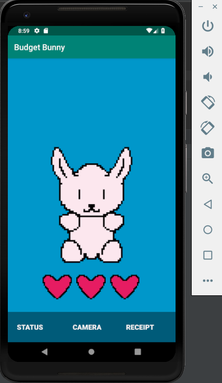
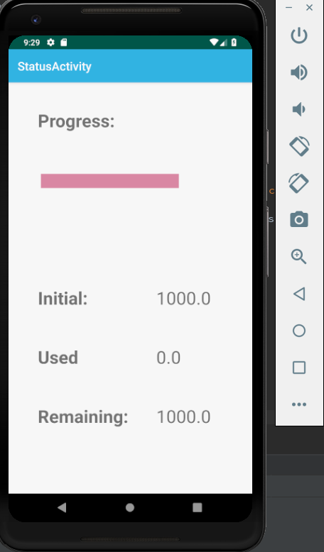
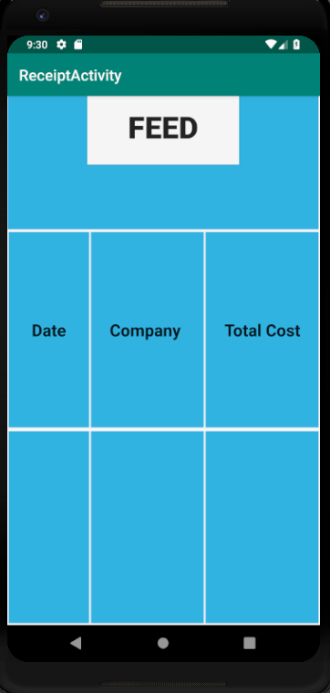

# BudgetBunny
BudgetBunny is the new budgeting app that allows you to scan and save your receipts, and monitor your spending! 

Simply click on the Camera button to take a picture of your reciept. Then, click on the "Feed" button to feed your receipt to your bunny. Your expenses for that receipt will automatically be deducted from your monthly budget, which you can set in the Status page

## Building the project
You can build and run the project on Android Studio

## Inspiration
During my application to NWHacks, I was pretty stumped on what to answer for the question on what I was planning on building here. One of my team members suggested I think of something that you _ can’t _ do yet with software, and see if you can implement it. After some thinking, I realized that there weren’t any good budgeting apps that allowed you to take pictures of your receipts every time you bought something. BudgetBunny was our solution; a way to integrate receipts that you get after purchases with a budgeting app (with a cute bunny!)

## What it does
The app is like a simple personal budgeting tool. You can input your monthly budget on the status page. As you make purchases, you can scan your receipts to subtract from your monthly allowance. Every time you add a receipt, you can “feed” it to your bunny, which makes it happy. Careful though: as you spend more, your budget shrinks, as does you bunny’s health bar. By making sure that your bunny is kept constantly happy, we hope to incentivize users to save more, and spend less.

## How we built it
Originally, we planned to use Python to parse the output from our camera vision API. We learnt that, in fact, it’s much easier to code everything in Java. Therefore, the entire project was implemented entirely in Java.

## Challenges we ran into
Like any other software project (especially those written in 24 hours), this project did not come without a heck of a lot of issues. For starters, setting up Android Studio was challenging at the beginning, due to issues with Gradle not recognizing the build properly. Furthermore, the Google camera vision api we were using kept trying to read the text sideways, so we had to quickly implement a workaround to rotate the image in the backend.

## Accomplishments that we're proud of
Well, primarily we’re proud that we finished the product, and got the minimum features required to make a product. It wasn’t easy, but it was definitely worth it. We’re also really proud of our cute bunny!

## What we learned
Well, the first thing we learnt is to have our environment set up _ before _ the competition. It would also help if everybody on our team knew how to use git, as a lot of time was spent doing that as well. I think if we also had more experience with Android development, the whole process would’ve been more streamlined, and we could’ve had time to implement more features.

## What's next for BudgetBunny
We’re definitely thinking of working more on this project in the future (preferably after a good night’s rest). There were a lot of features that we really wanted implemented, but simply didn’t have the time to create. For instance, we wanted features to export reciept data, show the items in the receipt itself, and implement a fancier UI. If we can get enough traction, we may even plan to release this app on the Play Store!

